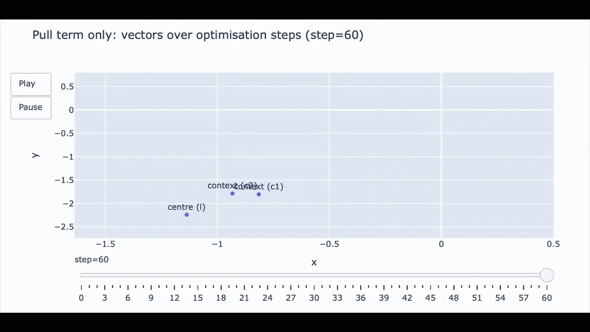
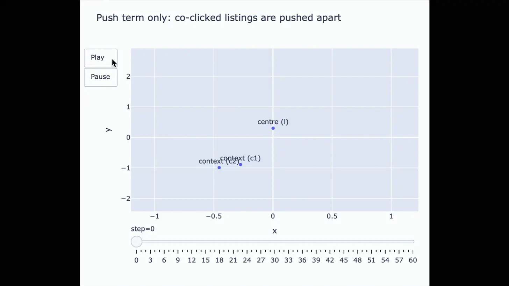
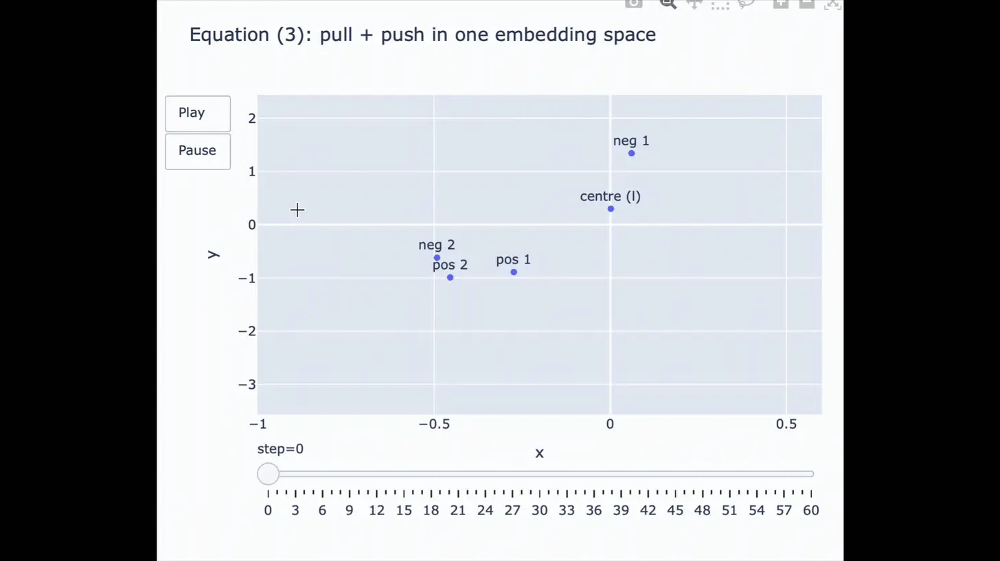
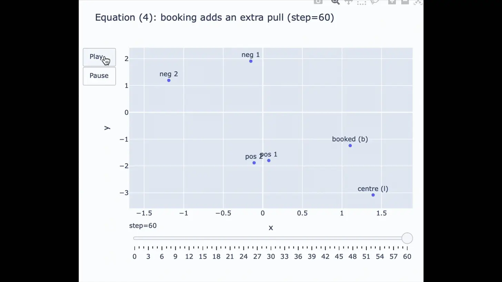

# Airbnb Personalisation Paper — Simulation Companion

This repository contains **toy simulations** that accompany a series of blog posts analysing and explaining Airbnb’s paper:

> **“Real-time Personalization using Embeddings for Search Ranking at Airbnb”**  
> Mihajlo Grbovic, Haibin Cheng — KDD 2018  
> https://dl.acm.org/doi/10.1145/3219819.3219885

The goal of this repo is **not** to reproduce Airbnb’s production system, nor to provide a reusable embedding library.  
Instead, it exists to **make the mechanics of the paper visible, intuitive, and inspectable**.

---

## What this repository is

### 1. A companion to blog posts

All simulations in this repository are written to support a series of long-form blog posts published on *The Senior Data Science Lead* newsletter.

These posts break down the Airbnb paper step by step, translating equations into intuition and connecting modelling choices back to real product constraints.

Relevant posts:
- **Part 1 – How Airbnb learned to understand listings via embeddings**  
  *(link to blog post)*
- **Part 2 – How Airbnb learned to personalise search with embeddings**  
  *(link to blog post)*

Each script in this repository corresponds to a specific section, equation, or design decision discussed in those posts.

---

### 2. A practical breakdown of the Airbnb paper

The Airbnb paper introduces a skip-gram–based embedding system adapted for travel search, including:

- Click-based listing embeddings
- Booking-aware objectives
- Global and market-aware negative sampling
- Cold-start handling for new listings
- User and listing type embeddings for long-term personalisation
- Explicit negative signals from host rejections
- Aggregation of embeddings into real-time ranking features

The simulations here are **directly inspired by the paper’s equations**, but they are deliberately simplified so that:

- The dynamics of optimisation are easy to visualise
- Individual forces (pull vs push) can be isolated
- Behaviour can be inspected step by step in low-dimensional space

---

### 3. Toy simulations, not production code

All simulations in this repository are **toy examples** by design.

They typically:
- Use very small numbers of embeddings (often 2–5 vectors)
- Run in 2D space to allow plotting and animation
- Use simplified gradient updates
- Ignore performance, scalability, and infrastructure concerns

This makes them suitable for:
- Understanding *why* each term exists in the loss
- Seeing how embeddings move under different forces
- Building intuition before working with real systems

It also means they are **not** suitable for training real embeddings.

---

## Repository structure

Below is a high-level overview of the main simulations and what they illustrate.

### Positive-only optimisation
**`positive_samples_simulation.py`**

Demonstrates what happens when embeddings are trained using only positive co-occurrences (clicks).

Key idea:
- Co-clicked items are pulled together
- Without negative samples, the embedding space collapses

Example output:

---

### Negative-only optimisation
**`negative_samples_simulation.py`**

Shows the opposite extreme: optimisation driven purely by negative samples.

Key idea:
- Unrelated items are pushed apart
- No structure emerges without positive signal

Example output:

---

### Full skip-gram objective (Equation 3)
**`equation_3_simulation.py`**

Simulates Airbnb’s core skip-gram objective with both positive and negative samples.

Key idea:
- Positive samples pull related listings together
- Negative samples prevent global collapse
- A stable geometry emerges

Example output:

---

### Booking as a stronger positive signal (Equation 4)
**`equation_4_simulation.py`**

Adds a booking term as a privileged positive signal.

Key idea:
- Bookings act as a global anchor for the session
- Rare but strong corrective force in the embedding space

Example output:

---

### Market-aware negative sampling (Equation 5)
**`equation_5_simulation.py`**

Illustrates why naïve negative sampling fails in travel search, and how market-aware negatives sharpen local discrimination.

Key idea:
- Global negatives teach coarse geography
- Market-aware negatives teach fine-grained choice within a city

Example output:

---

### Mixed user and listing embeddings (Part 2)
**`user_listing_embedding_simulation.py`** *(or equivalent)*

Simulates a shared embedding space containing both user types and listing types.

Key idea:
- User embeddings move toward the kinds of listings they book
- Listing embeddings move toward the kinds of users that book them
- A shared geometry enables similarity features in ranking

Example output:

[embedded image: user and listing embeddings in same space]

---

## How to use this repository

This repository is best used alongside the blog posts and the paper.

Suggested workflow:
1. Read the relevant section of the blog post
2. Open the corresponding simulation script
3. Run the simulation and inspect the plots
4. Observe how the embeddings move and why

The simulations are intentionally small and readable, so they can be modified easily to test alternative assumptions.

---

## What this repository is not

- ❌ A reproduction of Airbnb’s production system  
- ❌ A benchmark or training framework  
- ❌ A recommendation library  

It is a **thinking tool**, not a deployment artifact.

---

## License and attribution

All simulations are original implementations inspired by the public Airbnb paper.

Please cite the original paper if you reuse ideas in academic or professional work.
